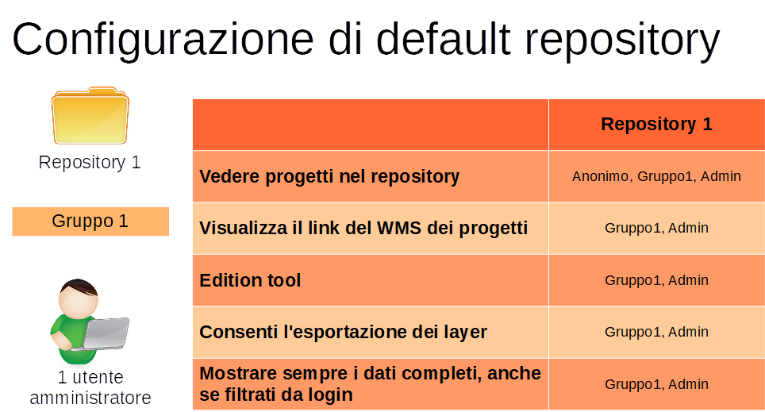
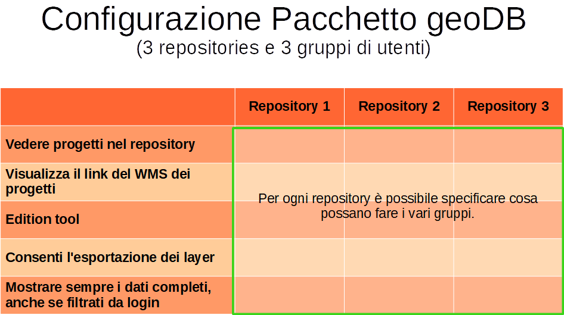
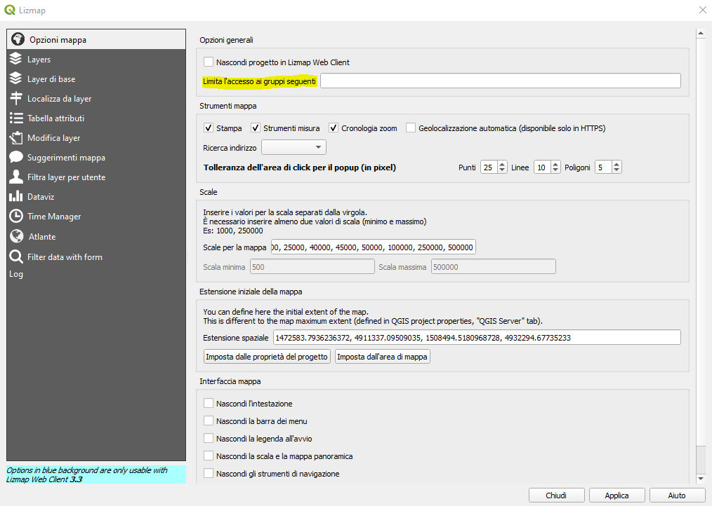
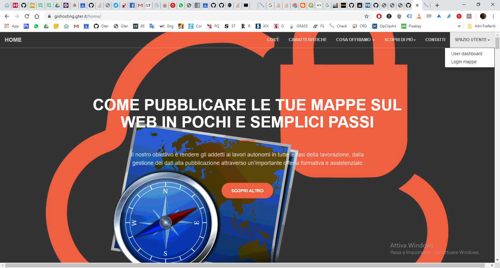
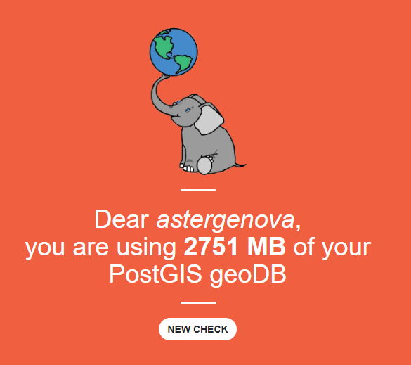
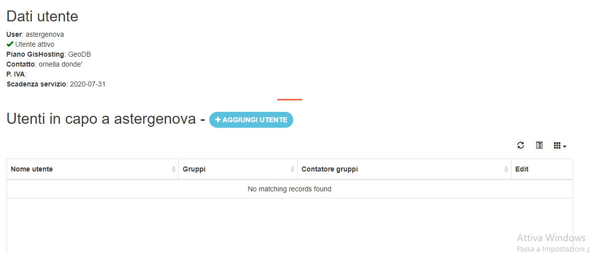
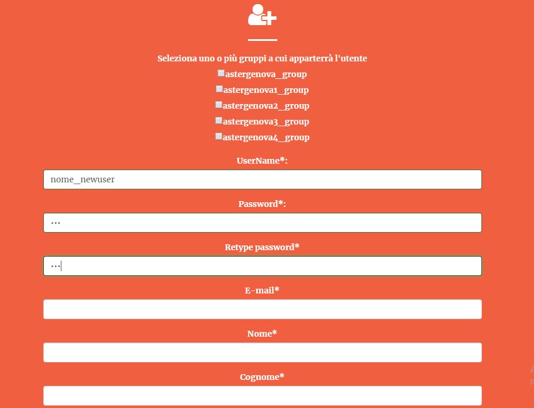
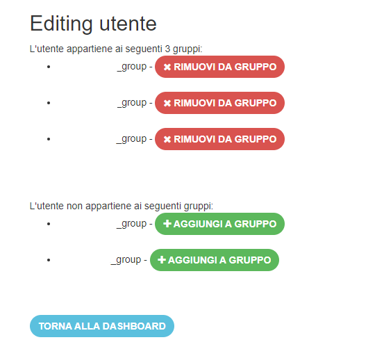

Manuale Amministratore
================================

Utenti e repository
-----------------------
GisHosting è basato sul webclient Lizmap. 
Lizmap consente di dare accesso ai repository o alle singole mapppe a specifici gruppi. 

Questa guida è pensata per gli utenti che acquistino il piano geoDB che include di default 

* un utente amministratore (con un suo gruppo)
* 3 gruppi utenti
* 3 repository utente 

A titolo di esempio supponendo che **user** sia l'utente amministratore ci saranno di default 4 gruppi:

* *user_group* (gruppo admin)
* *user1_group* 
* *user2_group* 
* *user3_group* 

E' sempre possibile (ma con un costo aggiuntivo rispetto al contratto base) richiedere l'aggiunta di repository. Per ogni repository viene creato un gruppo associato.

Di default ogni repository creato corrisponde a un gruppo come mostrato nella seguente figura

GisHosting è un server cloud condiviso, per cui occorre sottolineare che esistono due diverse figure:

* *utente amministratore*: è l'utente creato al momento della creazione del proprio spazio su GisHosting, di cui abbiamo già discusso. Ha accesso completo ai repository lizmap così come alla cartella di Nextcloud contenente i progetti QGIS da pubblicare 
* *amministratore di sistema*: che è invece rappresentato da chi gestisce il server GisHosting, ossia da personale di Gter 

Il solo **amministratore di sistema**, sulla base delle specifiche richieste dell'**utente amministratore**, può modificare i permessi per ogni repository secondo le seguenti regole:

* Vedere progetti nel repository
* Visualizza il link del WMS dei progetti
* Usa lo strumento edizione
* Consenti l'esportazione dei layer
* Mostrare sempre i dati completi, anche se filtrati da login

L' **utente amministratore** attraverso il plugin lizmap ha inoltre la possibilità di filtrare singoli progetti per ogni gruppo di utente agendo direttamente sul progetto QGIS. Ciò permette di limitare l'accesso e quindi la visualizzazione di specifici progetti ai diversi gruppi. Ad esempio, se si ha una repository che contiene 5 progetti ma il gruppo *user1_group* può visualizzare solo uno di questi 5 progetti, l'**utente amministratore** dovrà aprire i singoli progetti contenuti nel repository e, tramite il plugin Lizmap, specificare i gruppi che possono visualizzare i singoli progetti. Nel caso dell'esempio quindi, il gruppo *user1_group* dovrà essere indicato solo nel progetto che può effettivamente visualizzare. 

I nomi dei gruppi che hanno accesso al progetto devono essere inseriti, separati da virgola, nell'area di testo **Limita l'accesso ai gruppi seguenti** nella scheda **Opzioni Mappa** del plugin Lizmap

Gestione utenti (e gruppi)
---------------------------

Con queste funzionalità si può creare un numero illimitato di utenti (purchè il nome non sia già stato assegnato) da associare a specifici gruppi. **Non si possono invece creare nuovi gruppi.
Questa funzionalità come detto nelle precedenti sezioni è consentita al solo amministratore di sistema.** 

Accesso alla dashboard utente
**********************************
Dalla pagina principale di GisHosting https://gishosting.gter.it/home/ con il tasto in alto a destra si accede alla dashboard del proprio utente (solo per il piano geoDB)

Da questa schermata cliccando sul tasto "Check your data" è possibile inserire i seguenti dati:

* utente amministratore
* password utente amministratore
* il nome del proprio DB

Dashboard utente
******************

Una volta fatto l'accesso alla dashbord utente è possibile:

* visualizzare le dimensioni del proprio geoDB PostgreSQL/PostGIS:

* visualizzare l'elenco degli utenti associati al proprio **utente amministratore** oltre che, se necessario aggiungere nuovi utenti.

* visualizzare l'elenco delle attività svolte dai singoli utenti sui vari repository. La tabella riporta il tipo di attività (login, viemap, print, ecc.), il nome utente che ha svolto l'attività, il contenuto dell'attività (nel caso ad esempio del print è possibile visualizzare la stampa che è stata fatta), la repository e il progetto a cui l'utente ha fatto accesso. La tabella può essere ordinata e/o filtrata in modo da visualizzare ad esempio tutte le attività fatte da uno specifico utente o ad esempio per vedere tutti gli utenti che hanno compiuto una specifica attività.

.. image:: img/log_attivita.gif

Aggiungere nuovi utenti
++++++++++++++++++++++++++

Per aggiungere nuovi utenti bisogna completare un form in cui è necessario specificare almeno un gruppo di appartenenza:

Per ogni utente creato si possono modificare i gruppi di appartenenza.

Si ricorda che il gruppo *nomeutente_group* è il gruppo amministratore per cui occorre fare attenzione nell'assegnazione dei permessi.

Note finali
**************************************************************

Si ricorda infine che dal progetto QGIS, tramite il plugin lizmap, è possibile filtrare la visualizzazione del progetto e dei layer in funzione del gruppo utente 
..
e i dati di un layer sulla base del nome utente.

In tal caso si rimanda a:

guida di lizmap: https://docs.lizmap.com/3.5/it/publish/lizmap_plugin/layers.html

..
  * https://docs.lizmap.com/3.5/it/publish/lizmap_plugin/filtered_layers_login.html
..  
* video-tutorial: https://vimeo.com/83966790

GisHosting è il server su cloud basato sui software free ed open source *qgis-Server* e *Lizmap* ed è realizzato da `Gter srl`_  

.. _Gter srl: https://www.gter.it
