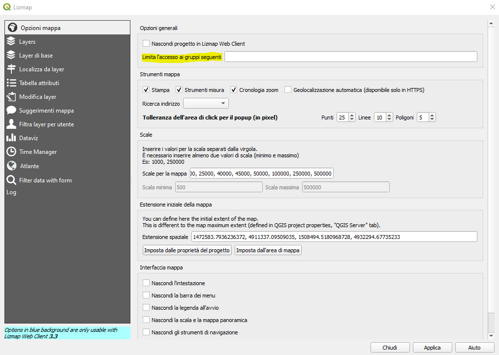

Introduzione
==================

Utenti e repository
------------------------------------------
GisHosting è basato sul webclient Lizmap. 
Lizmap consente di dare accesso ai repository o alle singole mapppe a specifici gruppi. 

Questa guida è pensata per gli utenti che acquistino il piano geoDB che include di default 

* 3 gruppi utenti
* 3 repository utente 
* un utente amministratore 

Per entrare nello specifico cominciamo ad individuare due diverse figure:

* *amministratore di sistema*: è rappresentato da chi gestisce il server GisHosting, ossia da personale di Gter 
* *utente amministratore*: è l'utente creato al momento della creazione del proprio spazio su GisHosting, ha accesso completo ai repository lizmap così come alla cartella di Nextcloud contente i progetti QGIS da pubblicare 

Di default ogni repository creato corrisponde a un gruppo come mostrato nella seguente figura

.. image:: img/default_repo.png

Il solo **amministratore di sistema**, sulla base delle specifiche richieste dell'**utente amministratore**, può specificare i permessi per ogni repository:

* Vedere progetti nel repository
* Visualizza il link del WMS dei progetti
* Usa lo strumento edizione
* Consenti l'esportazione dei layer
* Mostrare sempre i dati completi, anche se filtrati da login

.. image:: img/3repo.PNG

L' **utente amministratore** attraverso il plugin lizmap ha inoltre la possibilità di filtrare singoli progetti per ogni gruppo di utente.

Gestione utenti 
===========================================

Accesso alla dashboard utente
------------------------------------------
Dalla pagina principale di GisHosting https://gishosting.gter.it/home/ con il tasto in alto a destra si accede alla dashboard del proprio utente (solo per il piano geoDB)

.. image:: img/user_dashboard0.PNG

Da questa schermata cliccando sul tasto "Check your data" è possibile inserire i seguenti dati:

* utente amministratore
* password utente amministratore
* il nome del proprio DB

.. image:: img/user_dashboard0.PNG

Dashboard utente
------------------------------------------

Si possono così visualizzare le dimensioni del proprio geoDB PostgreSQL/PostGIS:

.. image:: img/dim_db.PNG

E l'elenco degli utenti associati al proprio **utente amministratore**, oltre che, se necessario aggiungere nuovi utenti.

.. image:: img/dati_utente.PNG

Per ogni utente creato si può poi procedere a specificare i gruppi di appartenenza

Per la personalizzazione
https://vimeo.com/83966790

**************************************************************

GisHosting è il server su cloud basato sui software free ed open source *qgis-Server* e *Lizmap* ed è realizzato da `Gter srl`_  

.. _Gter srl: https://www.gter.it
